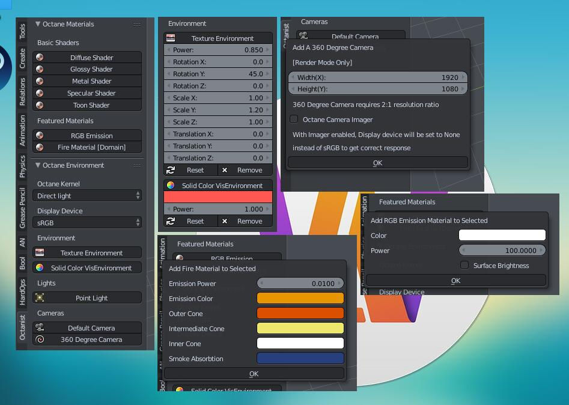

Next version will be developed after both Blender 2.8 and Octane 4 finally release since a lot of things will be changed
---

# About
This addon written in Python is called Octanist, which is a helper addon for the Octane render Blender plugin users to easily setup the scene for their art works powered by Octane Render

# Features

# Versions
> 2.0.0 - octanist_v2.py was first realeased on [Facebook group](https://www.facebook.com/groups/500738480259364) and [Github](https://github.com/itisltw/blender-octanerender-helper-addon_octanist) on March 27, 2018

> 1.0.0 - octanist_v1.py was first realeased on [Facebook group](https://www.facebook.com/groups/500738480259364) on March 9, 2018 

# Octane Blender Plugin Version
> OctaneRender™ for Blender 3.08 - 15.0

> Blender 2.79 b

# System Environment
> Windows, Mac OS X, Linux
